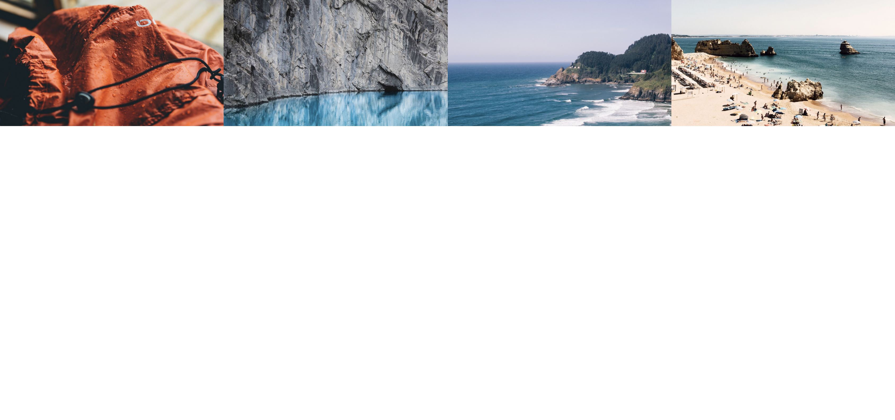
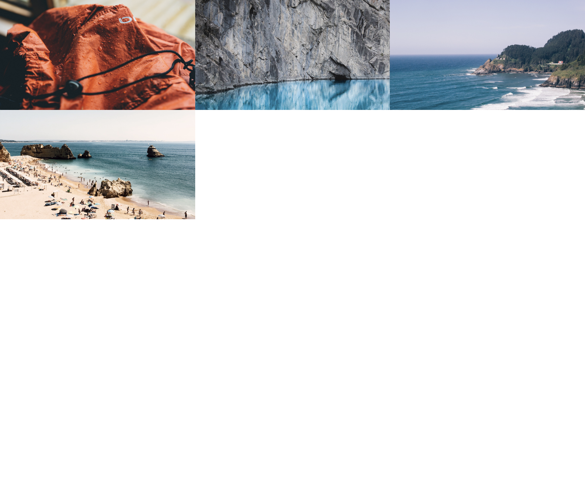
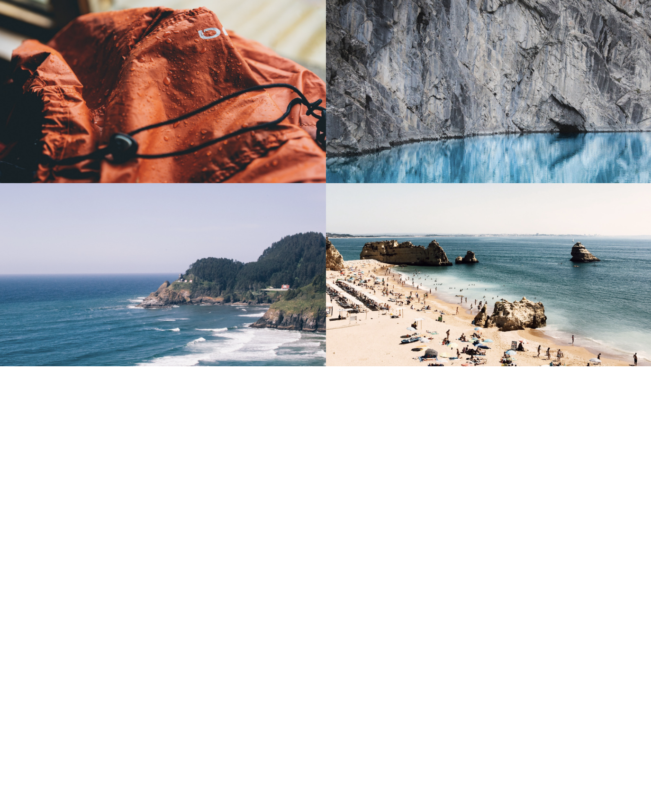
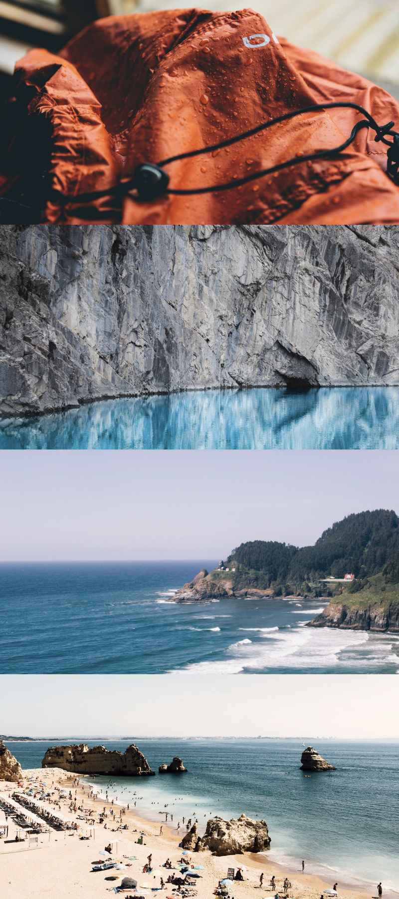

# Bootstrap Pic Collage

Make a responsive full screen picture collage using bootstrap's grid  system.

Use Unsplash Image API:

```
https://source.unsplash.com/1600x900/?nature,water&0
```

Change the `0` at the end to a different number to represent a different image in the collage.


### Large Screens


### Medium Screens


### Tablet Screens


### Mobile Screens

